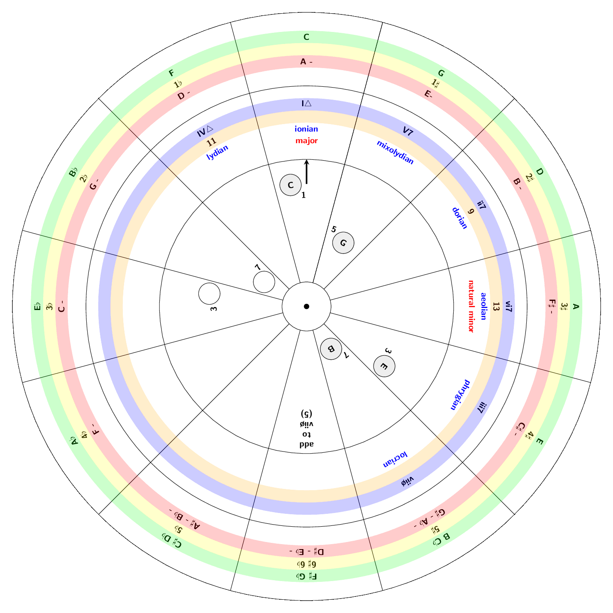

# Circle Of Fifths

Circle of fifths with degrees, modes and chord-finder written in LaTeX and TikZ.

*Example*

You can use the file [circle_of_fifths.tex](circle_of_fifths.tex) to create three PDF's, print, cut out (, laminate) and join them in the center:

*(older version)*

For instructions, descriptions and more information please read the documentation:

* https://ronligt.github.io/Circle-Of-Fifths/

## Acknowledgement

*Many thanks to Joel Mabus for his Wheel Of Fifths <http://www.joelmabus.com/mabus%20wheel%20of%20fifths.htm> and the authors of the code found in <https://tex.stackexchange.com/questions/442783/circle-of-fifths-diagram-with-printed-music-in-latex>*
