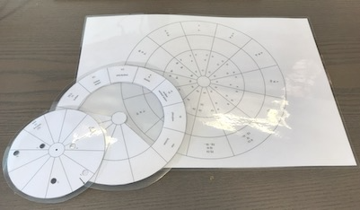
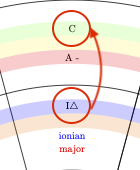

Circle of fifths with degrees, modes and chord-finder written in $`\LaTeX`$ and PGF/Ti*k*Z.

<figure markdown>
  { width="500" }
  <figcaption>Example</figcaption>
</figure>

You can use the file [circle_of_fifths.tex](https://github.com/ronligt/circle_of_fifths/circle_of_fifths.tex) to create three PDF's, print, cut out (, laminate) and join them in the center:

<figure markdown>
  { width="500" }
  <figcaption>Photo of laminated parts (older version)</figcaption>
</figure>

## Instruction

In the LaTeX document look for the `Phase` comments and follow the instructions. Print after each phase. The document is set default to the first phase.

Note that in the 'degree'-layer you need to cut out the parts where it says `cut out`...

If you cannot create the PDF's please download the [base.pdf](https://github.com/ronligt/circle_of_fifths/base.pdf), [degree.pdf](https://github.com/ronligt/circle_of_fifths/degree.pdf) and [chords.pdf](https://github.com/ronligt/circle_of_fifths/chords.pdf).

You can try to join the three pieces in the center with a [split pin](https://en.wikipedia.org/wiki/Brass_fastener).

## Description

**nomenclature:**

***tonic***
: the root or home note of a key

***key*** and ***scale***
: the order of notes determined by the tonic. For the purpose of this text key and scale are similar. Although: "A scale is musical notes arranged in an order, whereas a key is determined by the tonic note from which we derive the chords of a scale. A mode is an elaboration of a scale." (from <https://www.musicianwave.com/key-vs-scale-vs-mode/>)

***degree***
: the position of a particular note on a scale relative to the tonic (from <https://en.wikipedia.org/wiki/Degree_(music)>)

***mode***
: a scale of notes within one key starting at a certain note in that key, each mode with its own "characteristic melodic and harmonic behavior" (loosely from <https://en.wikipedia.org/wiki/Mode_(music)>)

<figure markdown>
  { width="500" }
  <figcaption>Example with colors</figcaption>
</figure>

The upper ring on the base plate shows the root note (*tonic*) of the major keys ([green ring](){ .bg_green }) in the circle of fifths, below this note is the number of $`\flat`$ or $`\sharp`$ in that key ([yellow ring](){ .bg_yellow }) and below that the parallel minor tonic ([red ring](){ .bg_red }) (e.g. $`\textrm{A-}`$ is the parallel minor of $`\textrm{C}`$).

The middle ring shows the seven degrees (scale step) in a key from $`\textrm{I}\triangle`$  to $`\textrm{vii\o}`$ ([blue ring](){ .bg_blue }). These consist of a roman number and a $`\triangle`$, a 7 or a $`\textrm{\o}`$. An upper roman number indicates a major chord (major third) and a lower roman number a minor chord (minor third). The $`\triangle`$ indicates a major seventh chord, the 7 a minor seventh chord and the $`\textrm{\o}`$ a half-diminished seventh chord (minor third, diminished fifth and minor seventh). Below the degrees in some cases the odd note numbers above the octave are shown: the 9th, 11th and 13th as they are often used as extensions of a chord ([orange ring](){ .bg_orange }). Below that the names of the modes corresponding with the degree from $`\textrm{ionian}`$ to $`\textrm{locrian}`$ ([blue text](){ .blue }). Below the $`\textrm{ionian}`$ and $`\textrm{aeolian}`$ it shows the common names $`\textrm{major}`$ and $`\textrm{natural minor}`$ ([red text](){ .red }).

The inner disc show the notes in a chord in the holes on the disc together with their note numbers. The chord is selected with the arrow on the disc (see [Usage](#usage) for more information).

## Usage

1. Turn the middle ring (the degrees) with the $`\textrm{I}\triangle`$ (*ionian*) pointing to the tonic of your major key in the upper ring (closest to the edge, in the example above pointing to $`\textrm{C}`$).

    

    For the minor key point the  $`\textrm{vi}7`$ ($`\textrm{aeolian}`$) to the tonic of your minor key in the upper ring (again closest the edge, in the example above pointing to $`\textrm{A}`$).

    .

1. Rotate the arrow on the inner disc to point to the desired chord (=degree) on the middle ring.

    

1. On the inner disc you find the notes of that chord in the selected key (in the example on top: $`\textrm{C}`$-$`\textrm{E}`$-$`\textrm{G}`$-$`\textrm{B}`$).

    

    Note that for the seventh degree $`\textrm{vii\o}`$ you will need to add the upper note indicted in the slice with "$`\textrm{add to vii\o (5)}`$".

### Find the scale

Disclaimer: the author of this text is an amateur musician at best and his theoretical knowledge is very basic. The following tips are from his own experience and have not been checked by a professional musician.

There are several steps that might help to figure out the tonic and the key of a piece of music:

1. how many $`\flat`$ or $`\sharp`$ are written at the start of the piece? In the upper ring you can find the corresponding major or minor key
1. what is the last chord of the piece? More than often a piece of music ends with the root chord (chord starting with the tonic of the key) or tonic
1. what is the first chord of the piece? Also often a piece of musics starts with the root chord
1. check the chords in the piece and rotate the middle ring with the degrees until it fits (most) of these chords (pay attention to major/minor and seventh). At the first degree ($`\textrm{I}\triangle`$) you will find the tonic of the major key in the upper ring and at the sixth degree ($`\textrm{vi}7`$) you will find the tonic of the minor key in the upper ring

Is the piece major or minor?

1. listen to the music! Although this being a grave oversimplification a minor song tends more towards a 'sad' emotion whereas a major songs gives you a more 'happy' feeling
1. again the last chord of the piece. If this is the root chord the chord itself will tell you if the key is major or minor
1. this will also uphold if the first chord of the piece is the root chord

### Read a chord

Chords are typically a combination of three or more notes. Each chord has a name indicating the root note of the chord together with added letters, numbers and symbols to specify all the other notes in the chord. An example of a chord can be $`\textrm{C}7`$:

* The $`\textrm{C}`$ indicates the root note of the chord
* The $`\textrm{C}`$-chord consists of three notes: the tonic, the major third (four semitones from tonic) and the perfect fifth (seven semitones from tonic)
* The $`\textrm{7}`$ indicates the addition of the **minor** seventh (ten semitones from tonic)

The resulting notes of this chord are:

* $`\textrm{C}`$ *tonic*
* $`\textrm{E}`$ *major third*
* $`\textrm{G}`$ *perfect fifth*
* $`\textrm{B}\flat`$ *minor seventh*

Sometimes you see the following notation: $`\textrm{D}_{\textrm{/}_\textrm{E}}`$. This is called *D over E* (or *slash chord*). The chord is $`\textrm{D}`$ and the bass note is the $`\textrm{E}`$ and not the tonic of $`\textrm{D}`$ scale (being $`\textrm{D}`$).

Below is a list of symbols that can be used:

| symbol | name | meaning | semitones from tonic
| :---: | --- | --- | :---:
| $`\textrm{-}`$ | *minor third* | | 3
| $`\textrm{m}`$ | *minor third* | | 3
| $`\triangle`$ | *major seventh* | | 11
| $`\textrm{Maj7}`$ or $`\textrm{Maj}`$ or $`\textrm{M7}`$ or $`\textrm{M}`$ | *major seventh* | | 11
| $`\flat5`$ | *diminished fifth* | also with other notes, e.g. $`\flat9`$ | 6
| $`\textrm{\o}`$ | *half diminished* or *half dim* | *tonic* - *minor third* - *diminished fifth* -  *minor seventh* | 0 - 3 - 6 - 10
| $`\textrm{o}`$ or $`\textrm{dim}`$ | *diminished* | *tonic* - *minor third* - *diminished fifth* -  *diminished seventh* | 0 - 3 - 6 - 9
| $`\textrm{+}`$ | *augmented fifth* | | 8
| $`\textrm{aug}`$ | *augmented fifth* | | 8
| $`\sharp5`$ | *augmented fifth* | also with other notes, e.g. $`\sharp11`$ | 8
| $`\textrm{sus}`$ or $`\textrm{sus4}`$ | *perfect fourth* | fourth instead of third | 5
| $`\textrm{sus2}`$ | *major second* | second instead of third | 2
| $`\textrm{6}`$ | *major sixth* | sixth instead of fifth | 9
| $`\textrm{9}`$ | *major ninth* | mostly implies seventh | 14
| $`\textrm{11}`$ | *perfect eleventh* | mostly implies seventh | 17
| $`\textrm{13}`$ | *major thirteenth* | mostly implies seventh | 21
| $`^6/_9`$ or $`\textrm{6add9}`$ | *six nine* | sixth instead of fifth and ninth instead of seventh | 0 - 3 - 9 - 14

## Acknowledgement

*Many thanks to Joel Mabus for his Wheel Of Fifths <http://www.joelmabus.com/mabus%20wheel%20of%20fifths.htm> and the authors of the code found in <https://tex.stackexchange.com/questions/442783/circle-of-fifths-diagram-with-printed-music-in-latex>*
